# ADRC-OF: Active Disturbance Rejection Control-Based Optimization Framework

[](LICENSE)
[](https://www.mathworks.com/)
[](https://github.com/Xjing140/ADRC-OF)

[**中文版**](README_CN.md)

> **A lightweight closed-loop optimization framework that reformulates population-based optimization as a tracking-and-regulation process with explicit disturbance estimation and rejection.**

---

## Overview

**ADRC-OF** is a novel metaheuristic optimization framework inspired by Active Disturbance Rejection Control (ADRC). Unlike conventional optimization algorithms that rely on heuristic random perturbations with open-loop or weak-feedback designs, ADRC-OF systematically integrates three core ADRC components into the search dynamics:

| Component | Role in Optimization |
|-----------|---------------------|
| **LTD** (Linear Tracking Differentiator) | Generates a smooth trajectory guiding the population toward promising regions |
| **LESO** (Linear Extended State Observer) | Estimates aggregated disturbances caused by landscape irregularities, constraint interactions, and stochastic perturbations in real time |
| **LSEF** (Linear State Error Feedback) | Adaptively adjusts the search step size to balance exploration and exploitation |

A lightweight Lévy-flight diversity enhancement is also incorporated to prevent premature convergence. Despite its compact structure and low computational overhead, ADRC-OF achieves competitive or superior performance compared to representative state-of-the-art optimization methods.

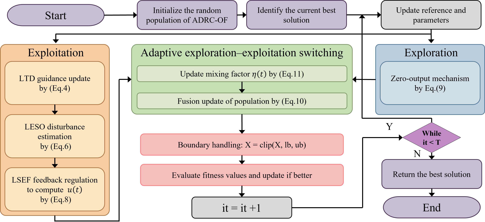

### Key Features

- **Closed-loop regulation**: First framework to reformulate population evolution as a feedback control process with explicit disturbance estimation
- **Lightweight design**: Simple architecture with only 4 tunable parameters and O(N×D×T) time complexity
- **Strong robustness**: Naturally handles noisy, irregular, and highly constrained landscapes via disturbance rejection
- **Validated on standard benchmarks**: CEC2017 and CEC2022 with competitive results
- **Real-world tested**: Seven constrained engineering case studies including ship maneuvering model identification

---

## Why ADRC for Optimization?

Most optimization algorithms can be viewed as *open-loop* systems — they apply perturbations without sensing or compensating for the landscape's "disturbances" (multimodality, constraints, noise). This leads to slow convergence or premature stagnation in complex problems.

PID-style algorithms add simple feedback (e.g., velocity in PSO), but lack explicit disturbance estimation. ADRC closes the loop completely: a tracking differentiator provides smooth guidance, an extended state observer estimates disturbances online, and the feedback law compensates for them in real time.

<p align="center">
  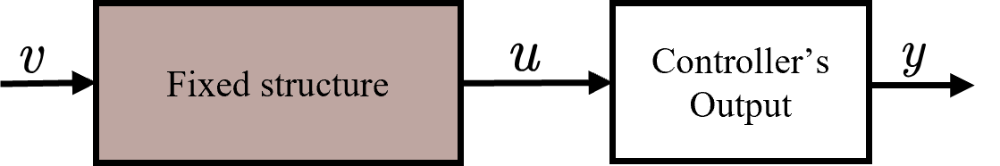
  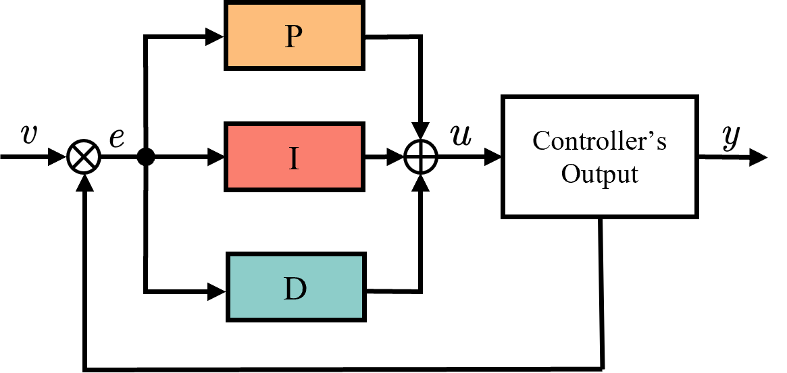
  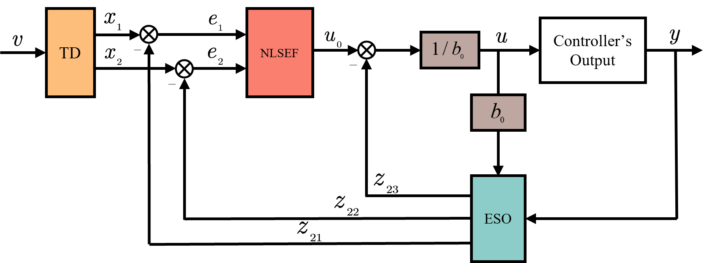
</p>

---

## Algorithm Architecture

The ADRC-OF algorithm consists of four main stages in each iteration:

```
1. LTD: Smooth trajectory generation toward the current best solution
2. LESO: Estimate system state (z1) and total disturbance (z2) for each individual
3. LSEF: Compute control input via feedback + disturbance compensation
4. Lévy Flight: Diversity-preserving exploration blended with control-driven search
```

### Pseudocode

```
Initialize population X randomly within [lb, ub]
Initialize LESO states z1=0, z2=0
Initialize LTD state x1 = TargetX (current best)

For t = 1 to T:
    1. Update global best TargetX, TargetF
    2. LTD:  x1 ← x1 - (x1 - TargetX) × r
    3. LESO: e_y ← z1 - X
             z1 ← z1 + (z2 + b×u - 2×Wo×e_y)
             z2 ← z2 - Wo²×e_y
    4. LSEF: u ← (kp×rand×(x1-z1) - z2×rand) / b × rand
    5. Lévy: out ← levy(N,D,β) × (x1 - TargetX) × decaying_factor
    6. Hybrid update: X ← X + a_t×u + (1-a_t)×out
    7. Boundary handling: X ← clamp(X, lb, ub)
    8. Evaluate new population
End
```

---

## Quick Start

### Prerequisites

- MATLAB R2022b or later (no additional toolboxes required)

### Installation

```bash
git clone https://github.com/Xjing140/ADRC-OF.git
```

### Minimal Example

```matlab
% Define a test function (10-D Sphere)
fun = @(x) sum(x.^2, 2);
nvars = 10;
lb = -100 * ones(1, nvars);
ub = 100 * ones(1, nvars);

% Run ADRC-OF
[TargetX, TargetF, Curve] = ADRCOF(fun, nvars, lb, ub, 50, 1000);

% Plot convergence
semilogy(Curve);
xlabel('Iteration'); ylabel('Best Fitness'); grid on;
fprintf('Best fitness: %.6e\n', TargetF);
```

Run the included demo script for more examples:

```matlab
demo
```

---

## Usage

### Function Signature

```matlab
[TargetX, TargetF, ConvergenceCurve] = ADRCOF(fun, nvars, lb, ub, N, T)
[TargetX, TargetF, ConvergenceCurve] = ADRCOF(..., 'ParamName', ParamValue)
```

### Input Parameters

| Parameter | Type | Description |
|-----------|------|-------------|
| `fun` | function handle | Objective function. Must accept an N×D matrix and return an N×1 vector of fitness values. |
| `nvars` | integer | Number of decision variables (dimensionality). |
| `lb` | vector (1×D) | Lower bounds for each variable. |
| `ub` | vector (1×D) | Upper bounds for each variable. |
| `N` | integer | Population size. |
| `T` | integer | Maximum number of iterations (function evaluations = N × T). |

### Optional Parameters (Name-Value Pairs)

| Parameter | Default | Description |
|-----------|---------|-------------|
| `SEF_kp` | 0.165 | State error feedback gain. Higher values increase exploitation intensity. |
| `ESO_Wo` | 0.0775 | Observer bandwidth. Controls how quickly the ESO responds to changes. Larger values give faster tracking but more noise sensitivity. |
| `gain` | 0.012 | Estimated control gain `b`. Affects the compensation strength. |
| `Err_td` | 0.05 | Tracking differentiator gain `r`. Controls the smoothness of the reference trajectory. |
| `Verbose` | false | Print progress every 10% of iterations. |

### Output

| Output | Type | Description |
|--------|------|-------------|
| `TargetX` | vector (1×D) | Best solution found. |
| `TargetF` | scalar | Fitness value of the best solution. |
| `ConvergenceCurve` | vector (1×T) | Best fitness at each iteration. |

### Parameter Tuning Guide

Based on sensitivity analysis on CEC2017, the recommended parameter configuration is:

| Parameter | Recommended | Search Range |
|-----------|-------------|--------------|
| `SEF_kp` | 0.39 | [0.01, 0.5] |
| `ESO_Wo` | 0.08 | [0.01, 0.1] |
| `gain` | 0.02 | [0.005, 0.05] |
| `Err_td` | 0.06 | [0.01, 0.1] |

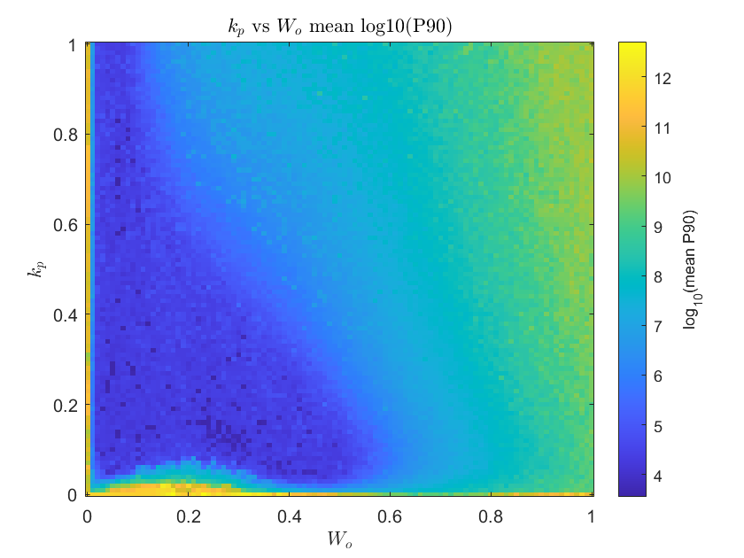

---

## Benchmark Results

### Runtime Comparison

ADRC-OF achieves competitive runtime efficiency on both CEC2017 and CEC2022 benchmark suites.

<p align="center">
  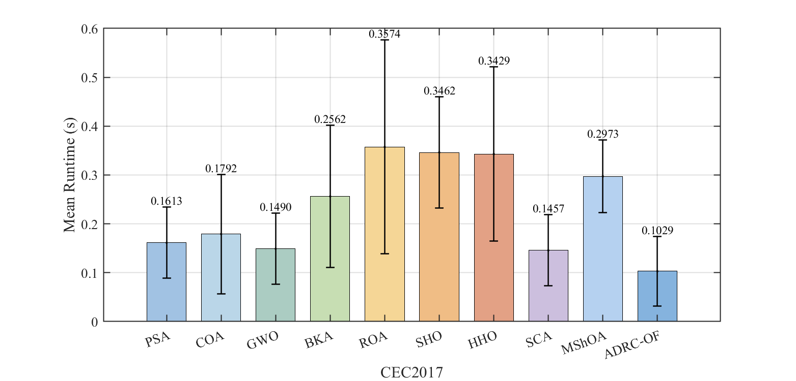
  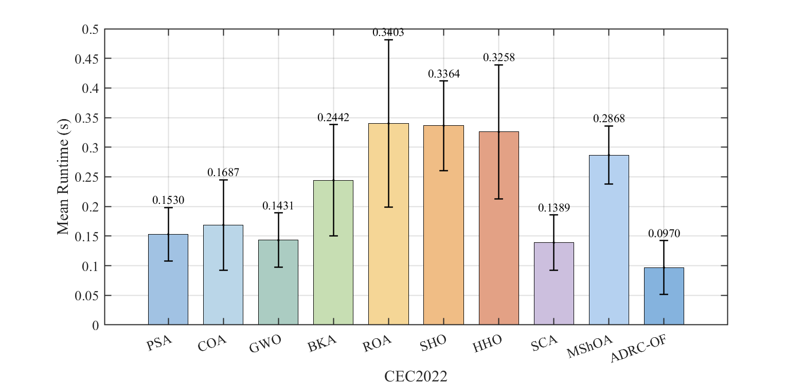
</p>

*Mean runtime (D=10, N=50, T=1000) with error bars representing standard deviation across test functions.*

### Convergence Behavior (CEC2017)

<p align="center">
  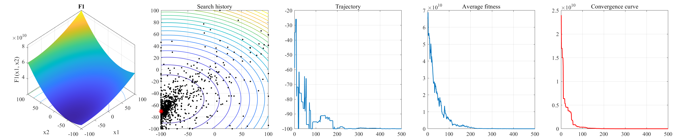
  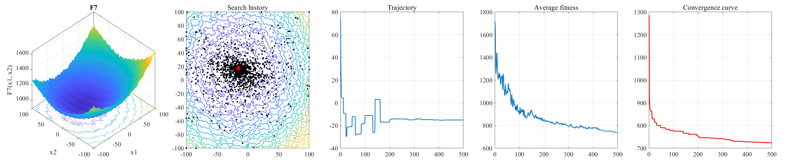
  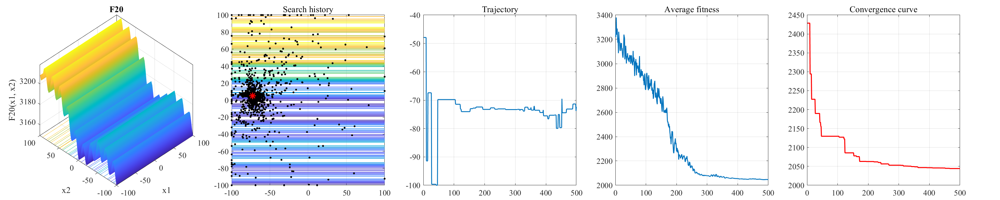
  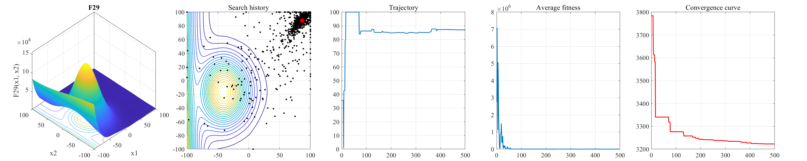
</p>

### Convergence Behavior (CEC2022)

<p align="center">
  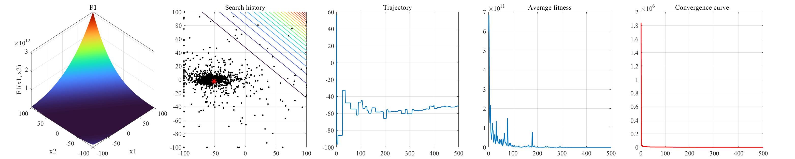
  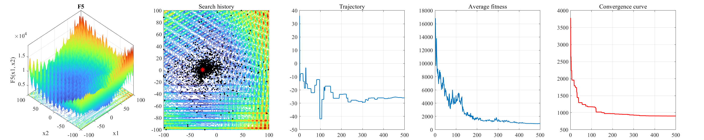
  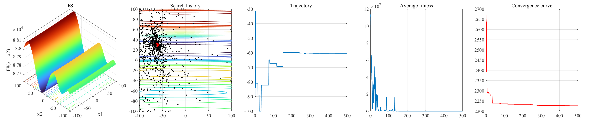
  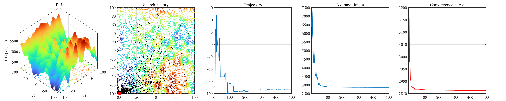
</p>

### Box Plot Analysis (CEC2022)

<p align="center">
  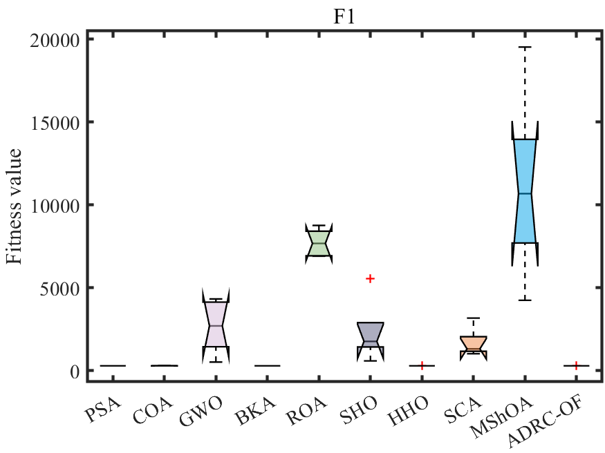
  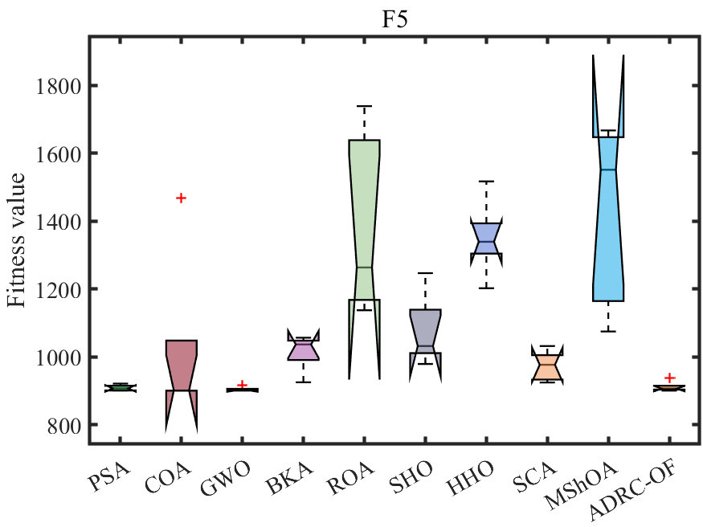
  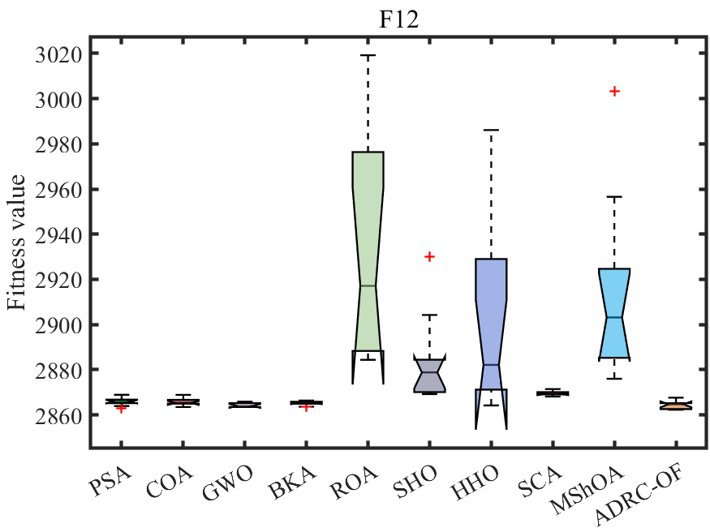
</p>

---

## Engineering Applications

ADRC-OF has been successfully applied to **7 constrained engineering optimization problems**:

| Problem | Type | Constraints |
|---------|------|-------------|
| Ship Maneuvering (MMG) Model Identification | Real-world parameter estimation | Nonlinear ODE coupling, measurement noise |
| Process Synthesis (PS) | Chemical engineering | Mass/energy balance |
| Reactor Network Design (RND) | Chemical engineering | Reaction kinetics |
| Haverly's Pooling (HP) | Operations research | Bilinear constraints |
| Car Side Impact Design (CSID) | Mechanical design | Safety regulations |
| Sawmill Operation (SO) | Industrial scheduling | Resource availability |
| SOPWM for 7-Level Inverters | Power electronics | Harmonic elimination |

<p align="center">
  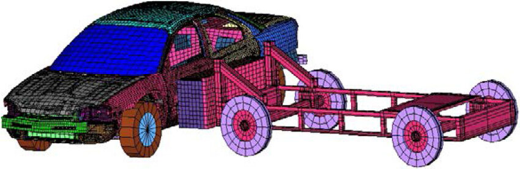
  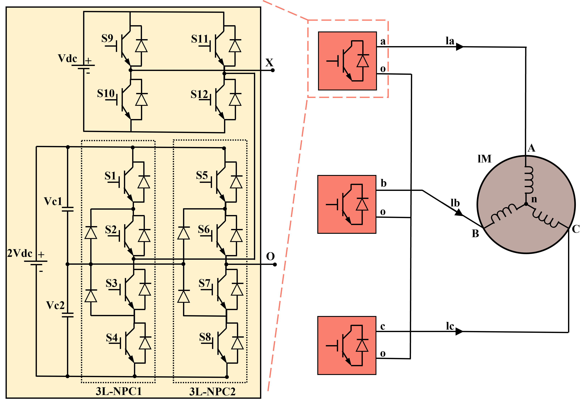
  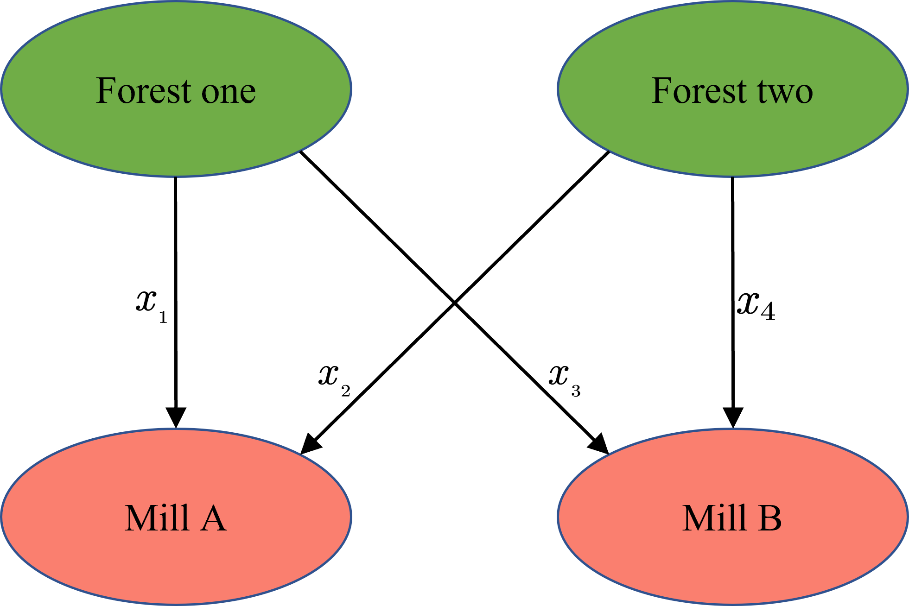
</p>

### Ship Maneuvering Parameter Identification

A real-world application to identify the hydrodynamic parameters of a ship maneuvering model (MMG model) using free-running trial data from the Dolphin 1 vessel:

<p align="center">
  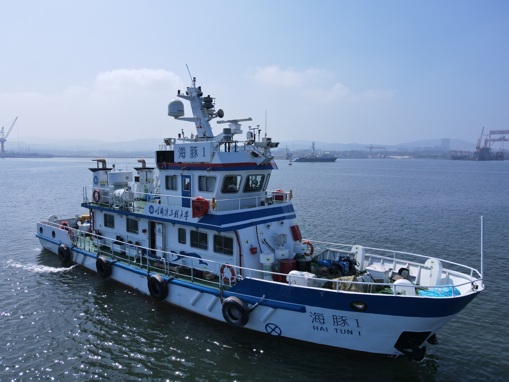
  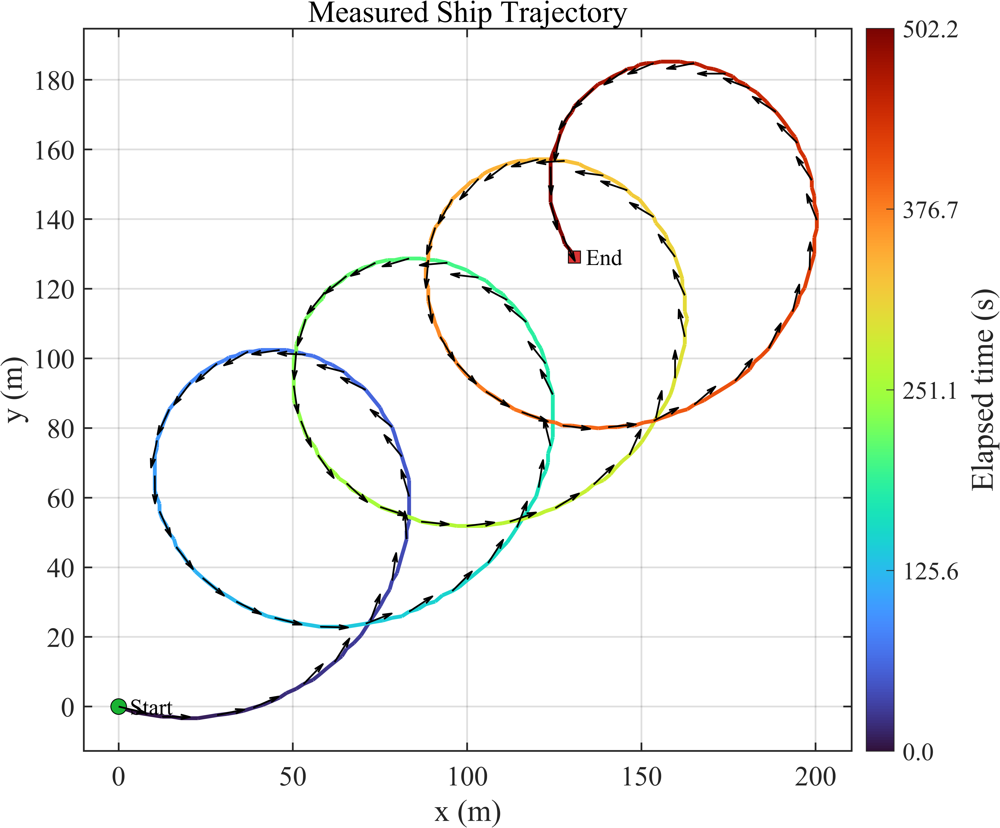
</p>

---

## Citation

If you use ADRC-OF in your research, please cite our paper:

```bibtex
@article{xiang2025adrcof,
  title     = {A Closed-Loop Active Disturbance Rejection Control-Based
               Optimization Framework for Constrained Engineering Optimization},
  author    = {Jing Xiang and Yingkai Ma and Wentao Zhou and Yuxuan Chen and
               Hua Guo and Guihua Xia},
  journal   = {Applied Soft Computing},
  year      = {2025},
  url       = {https://github.com/Xjing140/ADRC-OF}
}
```

---

## License

This project is licensed under the Apache License 2.0 — see the [LICENSE](LICENSE) file for details.

---

## Contact

- **Jing Xiang** — xiangjing@hrbeu.edu.cn
- **Guihua Xia** (Corresponding Author) — xiaguihua@hrbeu.edu.cn

College of Intelligent Systems Science and Engineering, Harbin Engineering University, Harbin 150001, China
